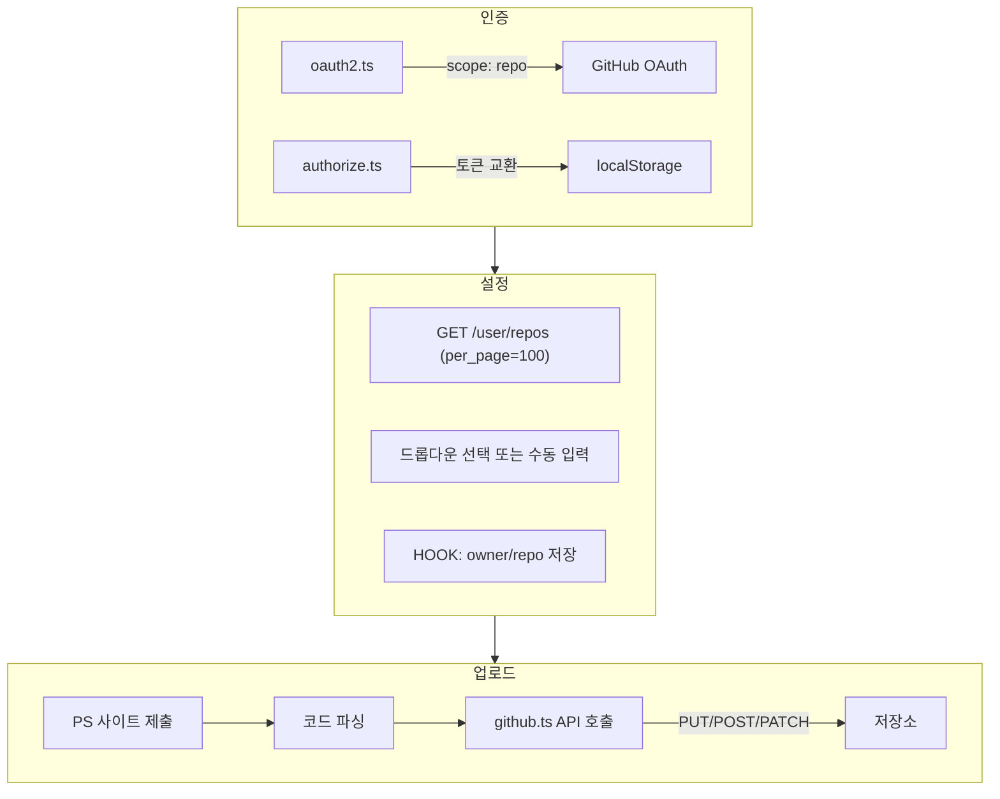

# BaekjoonHub Organization 지원 커스터마이징 계획

## 현재 상태 분석

### 아키텍처 요약




### 조직 접근이 안 되는 주요 원인

1. **OAuth 앱 승인**: GitHub Organization은 기본적으로 "Third-party application access policy"가 활성화되어 있어, 조직 소유자가 OAuth 앱을 승인해야 조직 저장소에 접근 가능
2. **저장소 목록 API**: `GET /user/repos`는 조직 저장소도 반환하지만, 조직이 앱을 승인하지 않으면 해당 저장소는 목록에 포함되지 않음
3. **저장소 생성**: 현재 "새 저장소"는 `username/TIL` 형식만 기본값으로 사용하며, 조직 내 저장소 생성 API(`POST /orgs/{org}/repos`)는 미구현

---

## 구현 계획

### Phase 1: OAuth 앱 설정 (필수 선행 작업)

**목적**: 스터디 운영자가 자신의 GitHub OAuth 앱을 사용해 조직에서 승인 가능하게 함


| 작업           | 파일                                           | 내용                                                                                                      |
| ------------ | -------------------------------------------- | ------------------------------------------------------------------------------------------------------- |
| OAuth 설정 분리  | [src/constants/url.ts](src/constants/url.ts) | `GITHUB_CLIENT_ID`, `GITHUB_CLIENT_SECRET`를 환경 변수 또는 빌드 시 주입 가능하게 변경                                    |
| Redirect URL | -                                            | GitHub OAuth App 설정에 `chrome-extension://[extension-id]/` 형태의 Redirect URL 등록 필요 (확장 프로그램 ID는 로드 시 결정됨) |


**참고**: Chrome 확장 프로그램의 경우 Redirect URL은 보통 `https://[extension-id].chromiumapp.org/` 또는 GitHub OAuth App 설정에 따라 다름. [manifest.json](src/manifest.json)의 `oauth2` 또는 콘텐츠 스크립트 URL 확인 필요.

### Phase 2: 조직 저장소 목록 확장

**목적**: 조직 저장소를 설정 화면에서 선택할 수 있게 함


| 작업         | 파일                                                                         | 내용                                                                                                             |
| ---------- | -------------------------------------------------------------------------- | -------------------------------------------------------------------------------------------------------------- |
| 조직 목록 조회   | [src/settings.ts](src/settings.ts)                                         | `GET /user/orgs`로 사용자가 속한 조직 목록 조회                                                                             |
| 조직별 저장소 조회 | [src/settings.ts](src/settings.ts)                                         | `GET /orgs/{org}/repos`로 조직 저장소 추가 조회 (또는 `user/repos?affiliation=owner,collaborator,organization_member`로 통합) |
| UI 개선      | [src/settings.html](src/settings.html), [src/settings.ts](src/settings.ts) | 저장소 드롭다운에 "개인 / 조직" 구분 표시, 조직 저장소는 `(조직명)` 라벨 추가                                                               |


**API 예시**:

```typescript
// 조직 목록
const orgs = await fetch("https://api.github.com/user/orgs", { headers: { Authorization: `token ${token}` } });

// 조직 저장소 (사용자가 write 권한 있는 것만)
const orgRepos = await fetch(`https://api.github.com/orgs/${org}/repos?per_page=100`, { headers: {...} });
```

### Phase 3: 조직 내 저장소 생성 (선택)

**목적**: 스터디 운영자가 조직에 멤버별 저장소를 확장 프로그램에서 생성할 수 있게 함


| 작업         | 파일                                                                         | 내용                                              |
| ---------- | -------------------------------------------------------------------------- | ----------------------------------------------- |
| 저장소 생성 API | 새 유틸 또는 [src/scripts/commons/github.ts](src/scripts/commons/github.ts)     | `POST /orgs/{org}/repos` 호출 함수 추가               |
| UI         | [src/settings.html](src/settings.html), [src/settings.ts](src/settings.ts) | "새 저장소 생성" 시 조직 선택 옵션 추가, `org/repo-name` 형식 지원 |


**주의**: `POST /orgs/{org}/repos`는 조직 내 `create_repository` 권한이 있는 사용자만 호출 가능. 일반 멤버는 기존 저장소만 연결.

### Phase 4: 문서화 및 에러 처리


| 작업        | 내용                                                                |
| --------- | ----------------------------------------------------------------- |
| 설정 화면 도움말 | "조직 저장소 사용 시: 조직 설정 > Third-party access에서 이 앱을 승인해 주세요" 안내 문구 추가 |
| 에러 메시지    | 403 등 API 실패 시 "조직 관리자에게 OAuth 앱 승인을 요청하세요" 등 구체적 안내              |


---

## 권장 구현 순서

1. **Phase 1** - OAuth 앱을 커스텀으로 사용할 수 있게 설정 (스터디용 포크의 핵심)
2. **Phase 2** - 조직 저장소 목록 표시 및 선택
3. **Phase 4** - 도움말 및 에러 메시지
4. **Phase 3** - (선택) 조직 내 저장소 생성

---

## 스터디 운영 시나리오

1. **운영자**: GitHub Organization 생성 → 자신의 OAuth App 등록 → 조직 설정에서 해당 앱 승인
2. **운영자**: 조직에 `member1-ps`, `member2-ps` 등 저장소 생성 (수동 또는 Phase 3 구현 시 확장 프로그램에서)
3. **멤버**: BaekjoonHub 커스텀 버전 설치 → OAuth 인증 (운영자 OAuth App 사용) → 자신의 `org/member1-ps` 저장소 연결
4. **멤버**: 백준/프로그래머스에서 문제 풀이 → 자동으로 조직 저장소에 푸시

---

## 확인 필요 사항

- **OAuth Redirect URL**: 현재 [url.ts](src/constants/url.ts)의 `GITHUB_REDIRECT_URL`이 `https://github.com/`로 되어 있음. OAuth 앱의 Authorized redirect URI와 일치하는지 확인 필요. (일부 확장 프로그램은 GitHub 페이지로 리다이렉트 후 콘텐츠 스크립트에서 `?code=` 파싱하는 방식을 사용)
- **저장소 생성 여부**: Phase 3(조직 내 저장소 생성)을 구현할지, 아니면 운영자가 수동으로 저장소를 만든 뒤 멤버가 "기존 저장소 연결"만 사용할지 결정 필요

